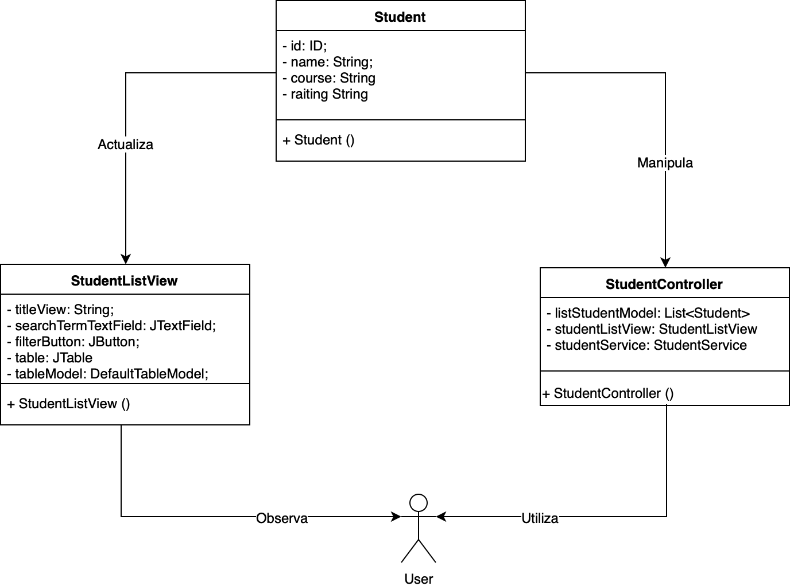

# Ejemplo de una aplicación MCV usando Swing y Java

El Modelo-Vista-Controlador es un patrón arquitectónico de software bien conocido para implementar interfaces de usuario en computadoras al dividir una aplicación en tres partes interconectadas. El objetivo principal de ***Model-View-Controller***, también conocido como MVC, es separar las representaciones internas de una aplicación de las formas en que se presenta la información al usuario. Inicialmente, MVC fue diseñado para aplicaciones GUI de escritorio, pero también se ha convertido rápidamente en un patrón extremadamente popular para diseñar aplicaciones web.

El patrón MVC tiene los tres siguientes componentes:

- Modelo que gestiona datos, lógica y reglas de la aplicación.
- Vista que se usa para presentar datos al usuario
- Controlador que acepta la entrada del usuario y la convierte en datos para el Modelo o la Vista.

## Diagrama MVC del ejemplo

El modelo recibe los datos del controlador. Almacena estos datos y actualiza la Vista. La vista permite presentar los datos proporcionados por el modelo al usuario. El Controlador acepta entradas del usuario y las convierte en comandos para el Modelo o la Vista.

